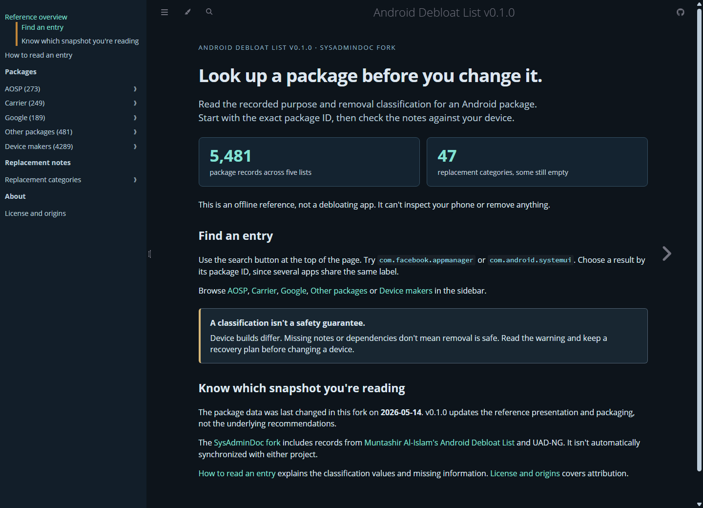
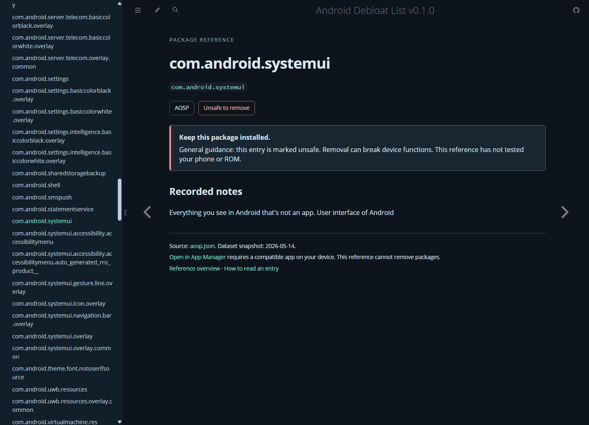

# Android Debloat List

[](https://github.com/SysAdminDoc/android-debloat-list/releases/tag/v0.1.0) [](LICENSE) [](docs/schema.md)

Look up an Android package before you change it. This reference brings together recorded package purposes and removal classifications, with replacement notes where they're available.

**5,481 package records. Five category lists.** Read the JSON directly or browse the searchable offline reference. This repository isn't a debloating app and cannot remove packages from your phone.

[Download the offline reference](https://github.com/SysAdminDoc/android-debloat-list/releases/download/v0.1.0/android-debloat-list-v0.1.0-offline.zip) · [Read the data format](docs/schema.md) · [Build it locally](docs/development.md)



## Find what you need

| Your task | Start here |
| --- | --- |
| Look up a package by its exact ID | Extract the [offline ZIP](https://github.com/SysAdminDoc/android-debloat-list/releases/download/v0.1.0/android-debloat-list-v0.1.0-offline.zip), open `reference/index.html` and use its search button. |
| Use the records in another tool | Read [the JSON format](docs/schema.md). This is the ADL format, not the UAD-NG schema. |
| Check a recorded alternative | Open the matching file in [suggestions/](suggestions) or follow Replacement notes in the browser. Some categories are empty. |
| Correct an entry | Read [CONTRIBUTING.md](CONTRIBUTING.md) and [report your evidence](https://github.com/SysAdminDoc/android-debloat-list/issues/new/choose). |

You don't need PHP or a connected phone to read the download. Search runs locally with JavaScript enabled. External references and the optional App Manager link open another site or app only when you follow them.

## Read the warning before the classification

The dataset's `delete` value means the entry recommends removal. **It does not mean removal is safe on every device.** ROMs, carrier builds and installed apps differ. Missing dependency information isn't proof that a package is unused.

The browser distinguishes recorded package notes from general safety guidance. `unsafe` entries stay clearly marked even when their original record has no separate warning.



No phone was debloated to produce these screenshots. They're real captures of this release's offline reference, not an Android app or a simulated removal result.

## What's in this snapshot?

| File | Coverage | Records |
| --- | --- | ---: |
| [aosp.json](aosp.json) | Android Open Source Project packages | 273 |
| [carrier.json](carrier.json) | Carrier packages | 249 |
| [google.json](google.json) | Google packages | 189 |
| [misc.json](misc.json) | Other packages | 481 |
| [oem.json](oem.json) | Device-maker packages | 4,289 |

The data was last changed in this fork on **2026-05-14**. v0.1.0 improves the documentation and reference browser; it doesn't refresh package-removal recommendations.

There are 4,074 records without a readable label, 278 unsafe records without a separate warning and 68 empty descriptions. The 47 replacement categories include 12 empty lists. Those gaps aren't filled with guesses. Suggested-app availability and device behavior haven't been rechecked for this release.

## Build and inspect

Install PHP 8.2+, mdBook 0.5.4 and Python 3.11+. Then run:

```sh
php scripts/lint.php
php scripts/test.php
python scripts/build.py
```

The build produces `dist/android-debloat-list-v0.1.0-offline.zip`. It includes the reference, unchanged JSON data, source and license notices. See [Build and verify](docs/development.md) for tool paths and release checks.

The source ZIP and SHA-256 checksums are on the [release page](https://github.com/SysAdminDoc/android-debloat-list/releases/tag/v0.1.0).

## Fork and license

This is the **SysAdminDoc fork** of [Android Debloat List](https://github.com/MuntashirAkon/android-debloat-list), created by Muntashir Al-Islam and contributors. It includes records derived from [UAD-NG](https://github.com/Universal-Debloater-Alliance/universal-android-debloater-next-generation), plus additions recorded in this fork's history. The projects are not automatically synchronized.

The [upstream online browser](https://muntashirakon.github.io/android-debloat-list/) is a separate edition and may contain different data. Download this fork's release when you need the snapshot described here.

Copyright (C) 2022 Muntashir Al-Islam. Distributed under [AGPL-3.0-or-later](LICENSE), without warranty. The original [COPYING](COPYING) is retained unchanged.

[Changelog](CHANGELOG.md) · [Remaining data review](ROADMAP.md) · [Originals and presentation reviews](assets/concepts/2026-09-09-marketing)
